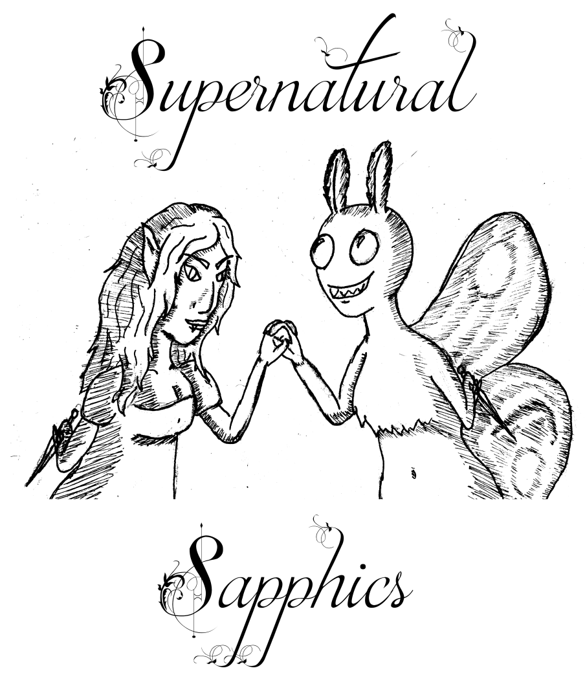

# Transcendent Tapir

Transcendent Tapir is a queer-owned game studio based in Michigan, making indie videogames and TTRPGs.

## Our Games

### TTRPGS

 Distorted Domains | Spectral Sleuths | Supernatural Sapphics
 :-: | :-: | :-:
[{cover image here}](https://transcendent-tapir.github.io/Distorted-Domains) | [{cover image here}](https://transcendent-tapir.github.io/Spectral-Sleuths) | 
A gonzo science fantasy adventure game using Distortion Dice | A game of ordinary people investigating supernatural phenomena using Distortion Dice | A Distortion Dice game about the relationships between creatures of the void and the humans close to them

### Video Games

The Meowty Mage

## The Team

### Khampheng Sikkema

Khampheng Sikkema  (they/she) aka PennyLeScroche is the founder of Transcendent Tapir. She has been developing games for nearly as long as she could use a computer and works in various areas including art, design, programming, and marketing. When they're not thinking about games, they're probably thinking about food or spending time with their family
